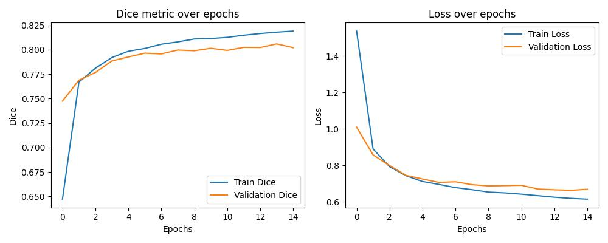

# Cityscapes Segmentation - EfficientNet and SegNet - PyTorch

## Introduction
This project is created with model's combination (EfficientNet as the backbone and SegNet).This is a multiclass segmentation project (20 classes) by using PyTorch for the framework. The model was trained with GPU Nvidia GTX 1050.

This project also can be trained in your local with running 'train.py'. Using this command:

```
python train.py --num_epochs 10 --batch_size 4 --learning_rate 1e-3 --num_classes 20
```

## Datasets
This dataset has 2975 training images files and 500 validation image files. Each image file is 256x512 pixels, and each file is a composite with the original photo on the left half of the image, alongside the labeled image (output of semantic segmentation) on the right half.

## Model
```
class SegNetDecoder(nn.Module):
    def __init__(self, in_ch, out_ch):
        super(SegNetDecoder, self).__init__()

        self.upsampler = nn.ConvTranspose2d(in_ch, out_ch, kernel_size=2, stride=2)
        self.conv_block = nn.Sequential(
            nn.Conv2d(out_ch, out_ch, kernel_size=3, padding=1),
            nn.BatchNorm2d(out_ch),
            nn.ReLU(inplace=True)
        )

    def forward(self, x, skip_connection):
        x = self.upsampler(x)
        if skip_connection is not None:
            skip_connection = F.interpolate(skip_connection, size=x.shape[2:], mode='bilinear', align_corners=False)
            x = x + skip_connection
        
        x = self.conv_block(x)
        return x
        
class EfficientSegNet(nn.Module):
    def __init__(self, n_classes):
        super(EfficientSegNet, self).__init__()
        
        self.n_classes = n_classes
        self.model_weights = EfficientNet_B0_Weights.IMAGENET1K_V1
        self.base_model = efficientnet_b0(weights=self.model_weights)
        self.encoder_layers = list(self.base_model.features.children())
        self.filters = [24, 40, 80, 112, 1280]

        for param in self.base_model.parameters():
            param.requires_grad = False

        # # Encoders
        self.encoder1 = nn.Sequential(*self.encoder_layers[:3]) # 3->24
        self.encoder2 = nn.Sequential(*self.encoder_layers[3]) # 24 - 40
        self.encoder3 = nn.Sequential(*self.encoder_layers[4]) # 40 - 80
        self.encoder4 = nn.Sequential(*self.encoder_layers[5]) # 80 -112
        self.encoder5 = nn.Sequential(*self.encoder_layers[6:9]) # 112 - 1280

        
        # Decoders
        self.decoder5 = SegNetDecoder(self.filters[4], self.filters[3])
        self.decoder4 = SegNetDecoder(self.filters[3], self.filters[2])
        self.decoder3 = SegNetDecoder(self.filters[2], self.filters[1])
        self.decoder2 = SegNetDecoder(self.filters[1], self.filters[0])
        self.decoder1 = SegNetDecoder(self.filters[0], self.filters[0])

        # # Out
        self.out = nn.Conv2d(self.filters[0], n_classes, 1)
        print(self.out)

    def forward(self, x):
        enc1 = self.encoder1(x)
        enc2 = self.encoder2(enc1)
        enc3 = self.encoder3(enc2)
        enc4 = self.encoder4(enc3)
        enc5 = self.encoder5(enc4)

        dec5 = self.decoder5(enc5, enc4)
        dec4 = self.decoder4(dec5, enc3)
        dec3 = self.decoder3(dec4, enc2)
        dec2 = self.decoder2(dec3, enc1)
        dec1 = self.decoder1(dec2, None)

        out = self.out(dec1)
        return out
```

## Metric and Loss Function

Metric for this project is dice coefficient metric and for the loss function is CrossEntropyLoss

## Results
Training the model for 15 epochs, with learning rate 1e-3. For the result, we got quiete good performance (dice 82.5% and loss 0.7). You can see the result below.



## Prediction 

